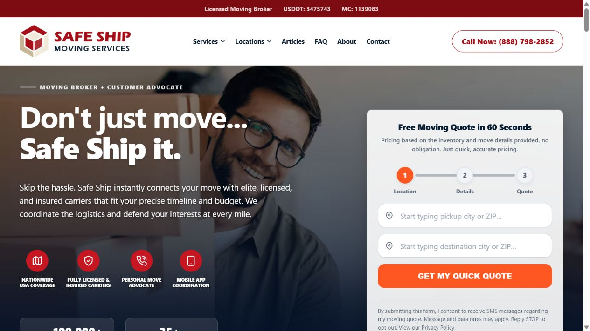
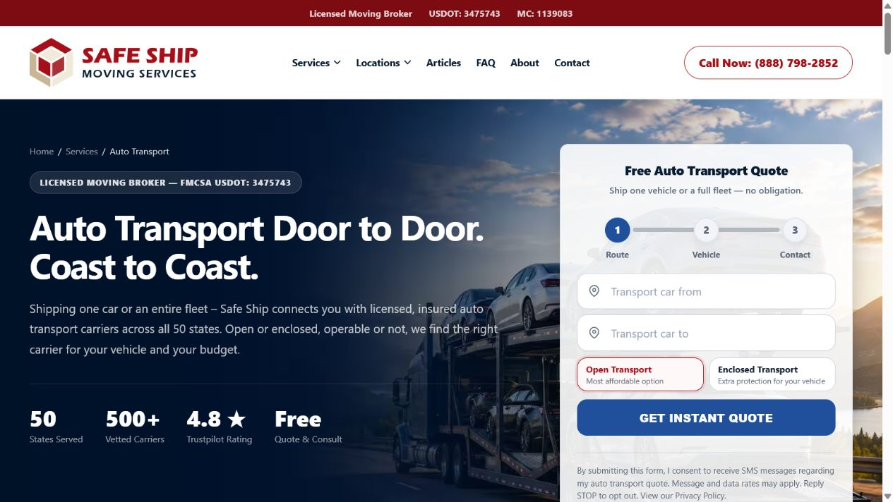
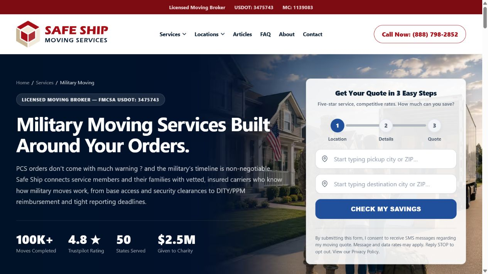
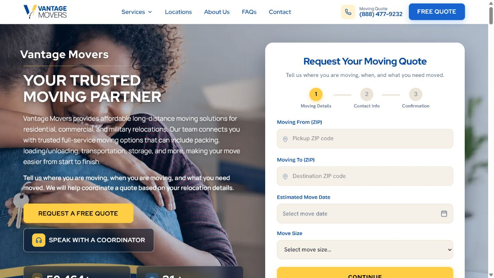
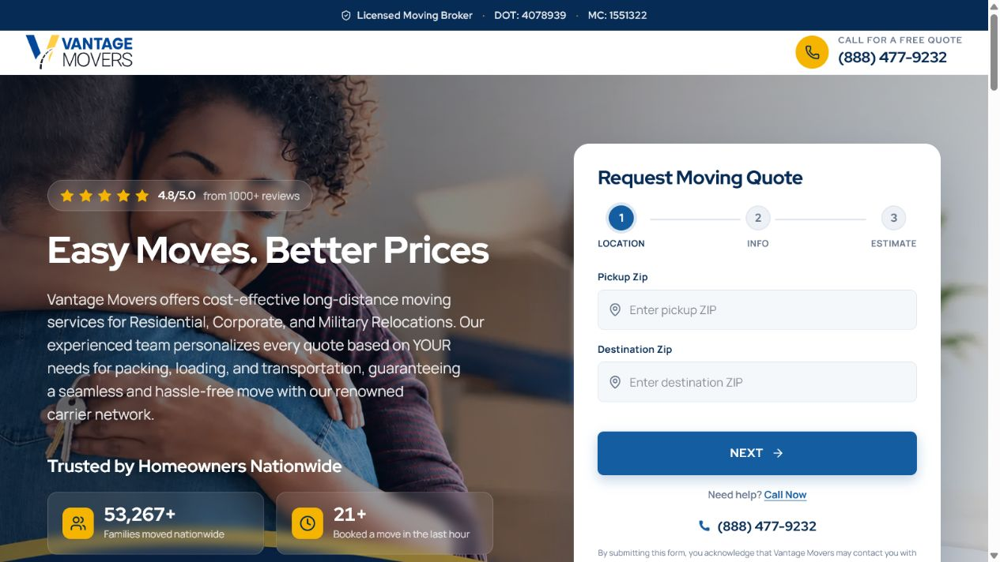

# Vantage Movers main-site expansion brief

Prepared July 15, 2026 for `apps/main-site`.

## Recommendation in one sentence

Keep the current Vantage visual system and quote contract, but turn the site into a route-based content platform: every major service gets its own search-friendly page, service-specific hero image and copy, the same shared quote inputs with service-specific presentation copy, tailored proof/process/FAQ content, and an English/Spanish publishing path.

This should be an adaptation of useful interaction and information-architecture patterns—not a copy of competitor wording, imagery, claims, or visual identity.

## What was reviewed

### Current Vantage surfaces

- [Vantage Home Movers](https://vantagehomemovers.com/) — the main site represented by this app.
- [Vantage Moves](https://vantagemoves.com/) — the shorter conversion-oriented landing site.
- Local code in `apps/main-site`, especially `HomePage.tsx`, `HeroSection.tsx`, `QuoteWizard.tsx`, `ServicesSection.tsx`, `ServicesDropdown.tsx`, `content.ts`, `images.ts`, `sitemap.ts`, and the homepage JSON-LD.

### Reference competitor

- [Safe Ship homepage](https://safeshipmoving.com/)
- [Safe Ship auto transport](https://safeshipmoving.com/services/auto-transport/)
- [Safe Ship military moving](https://safeshipmoving.com/services/military-moving-services/)

Captured reference screenshots:







Current Vantage comparison:





## Executive assessment

The Vantage main site is not technically a monolithic SPA. It is a Next.js App Router site whose homepage is assembled from reusable server and client components. The user experience is SPA-like because nearly all commercial content and navigation live on `/` and link to hash anchors.

The current site already has several competitive strengths:

- A strong split hero with clear copy, a prominent multi-step quote flow, phone CTA, and compliance-aware broker language.
- Reusable sections and a Storybook/playground workflow for visual iteration.
- A working content registry, image registry, quote schema, analytics hooks, API routes, testimonials stream, legal pages, sitemap, and structured data.
- A coherent Vantage visual identity that should be retained rather than replaced with Safe Ship's red/blue design.

The core disadvantage is depth:

- Service cards and the Services dropdown resolve to homepage anchors or `#quote`, not dedicated service routes.
- The sitemap has no commercial service routes.
- The hero, quote-form presentation copy, proof points, process, FAQs, and metadata are homepage-wide rather than service-specific.
- Structured data is homepage-only.
- There is no locale architecture; the document language, Open Graph locale, place lookup, and formatting are currently fixed to English/US.

Safe Ship's most useful pattern is specialization. Its pages change their hero message, imagery, proof, benefits, process steps, FAQs, and form presentation to match the service. Vantage should adopt that content specialization while intentionally retaining one input schema and one server submission route for every moving service.

## Competitive pattern matrix

| Capability | Current Vantage | Useful reference pattern | Vantage direction |
| --- | --- | --- | --- |
| Hero | Strong general moving hero | Service-specific background, headline, form, metrics | Keep Vantage styling; feed hero from route content |
| Quote form | Strong shared wizard and submission route | Reference pages specialize form presentation | Keep identical inputs, validation, payload, and server route; vary only visible copy |
| Service discovery | Cards route to quote/anchors | Cards lead to deep service pages | Cards lead to service pages; page CTAs lead to the relevant form |
| Proof | General metrics and review content | Route-specific proof bar | Use only verified Vantage metrics and relevant testimonials |
| Process | One general four-step section | Process language changes per service | Shared component, route-provided steps |
| Education | Broker description is present but dispersed | Broker-vs-carrier explanation and consumer resources | Make broker role explicit on every service route |
| SEO | Homepage and legal routes | Service metadata, FAQs, related routes | Per-route metadata, canonical, breadcrumbs, service/FAQ schema |
| Localization | None | Not the reference site's main differentiator | English unprefixed; Spanish under `/es` with hreflang |

## Proposed information architecture

### Launch routes

| Priority | English route | Spanish route | Form presentation | Hero-image concept |
| --- | --- | --- | --- | --- |
| P0 | `/services/long-distance-moving` | `/es/servicios/mudanzas-larga-distancia` | Long-distance title, helper text, and CTA | Family beginning an interstate move; highway/truck context without Vantage fleet branding |
| P0 | `/services/auto-transport` | `/es/servicios/transporte-de-autos` | Auto-transport title, helper text, and CTA | Open auto carrier on a wide U.S. route, vehicle detail visible |
| P0 | `/services/military-moving` | `/es/servicios/mudanzas-militares` | Military-move title, helper text, and CTA | Military family relocation context, generic truck, no protected insignia or endorsement implication |
| P1 | `/services/residential-moving` | `/es/servicios/mudanzas-residenciales` | Residential title, helper text, and CTA | Family/home inventory planning moment |
| P1 | `/services/corporate-office-moving` | `/es/servicios/mudanzas-de-oficina` | Office-move title, helper text, and CTA | Organized office packing and labeled workstations |
| P1 | `/services/packing-services` | `/es/servicios/servicios-de-embalaje` | Packing title, helper text, and CTA | Professional hands packing fragile household items |
| P1 | `/services/storage-options` | `/es/servicios/opciones-de-almacenamiento` | Storage title, helper text, and CTA | Clean, organized warehouse/storage vault context |
| P1 | `/services/senior-moving` | `/es/servicios/mudanzas-para-personas-mayores` | Senior-move title, helper text, and CTA | Older adult and family reviewing a calm move plan |

Avoid launching both “interstate” and “long distance” pages with substantially duplicated copy. Start with one canonical page and add a second route only when it has distinct search intent and content.

### Later expansion

- `/services` index page.
- State and high-value corridor pages with truly local content, not thin programmatic duplicates.
- Guides/resources for inventory preparation, estimates, broker vs. carrier roles, claims, delivery windows, auto shipping preparation, PCS/PPM planning, and consumer rights.

## Shared service-page template

Every service route should use a common template while accepting route-specific content and component slots.

1. Compliance bar and global header
2. Breadcrumbs
3. Service hero
   - Broker/license eyebrow
   - One clear H1
   - Two-sentence service promise
   - Three or four verified proof points
   - The shared quote form with service-specific title, helper text, and CTA copy
4. Trust/verification band
5. “What this service includes” benefit grid
6. Service-specific four-step process
7. Broker vs. motor-carrier responsibilities
8. Service-specific education or planning checklist
9. Relevant testimonials
10. Nationwide coverage
11. Related services
12. Service-specific FAQs
13. Final quote CTA
14. Compliance-rich footer

### Desktop wireframe

```text
┌──────────────────────────────────────────────────────────────────────────┐
│ LICENSED MOVING BROKER • USDOT / MC • CONSUMER RESOURCES               │
├──────────────────────────────────────────────────────────────────────────┤
│ LOGO      SERVICES  LOCATIONS  GUIDES  ABOUT  ES      PHONE   FREE QUOTE│
├──────────────────────────────────────────────────────────────────────────┤
│ Breadcrumbs                                                              │
│ ┌──────────────────────────────────┬───────────────────────────────────┐ │
│ │ SERVICE-SPECIFIC HERO IMAGE      │ SERVICE QUOTE FORM                │ │
│ │ Broker eyebrow                   │ Step 1 • Step 2 • Done            │ │
│ │ H1 + concise service promise     │ Same fields and submission route  │ │
│ │ Proof points / metrics           │ Consent + privacy language        │ │
│ └──────────────────────────────────┴───────────────────────────────────┘ │
├──────────────────────────────────────────────────────────────────────────┤
│ VERIFIED TRUST / REVIEW / CONSUMER-RESOURCE BAND                         │
├──────────────────────────────────────────────────────────────────────────┤
│ WHAT IS INCLUDED                 3–6 SERVICE-SPECIFIC BENEFIT CARDS       │
├──────────────────────────────────────────────────────────────────────────┤
│ HOW IT WORKS                     01 → 02 → 03 → 04                       │
├──────────────────────────────────────────────────────────────────────────┤
│ BROKER ROLE                      │ MOTOR-CARRIER ROLE                    │
├──────────────────────────────────────────────────────────────────────────┤
│ PLANNING GUIDE / CHECKLIST       │ SUPPORTING GENERATED IMAGE            │
├──────────────────────────────────────────────────────────────────────────┤
│ RELEVANT REVIEWS  •  COVERAGE  •  RELATED SERVICES                      │
├──────────────────────────────────────────────────────────────────────────┤
│ SERVICE FAQS                                                              │
├──────────────────────────────────────────────────────────────────────────┤
│ FINAL CTA + QUOTE ANCHOR                                                   │
├──────────────────────────────────────────────────────────────────────────┤
│ FOOTER: SERVICES • COMPANY • CONSUMER INFO • LEGAL • LICENSE DISCLOSURE  │
└──────────────────────────────────────────────────────────────────────────┘
```

### Mobile behavior

- Header reduces to logo, tap-to-call, quote CTA, and a menu button.
- Hero order is H1/message → two proof points → quote form; the background image becomes a cropped banner rather than text sitting on a busy photo.
- The first quote step stays short enough to fit without a long scroll.
- Benefit cards, process steps, broker/carrier explanation, and related services stack in a single column.
- A sticky mobile action can expose “Call” and “Free Quote,” but must not obscure consent, legal, or form controls.

## Form strategy

The single quote contract is an explicit product invariant:

- Keep `quoteFormSchema`, `STEP_FIELDS`, the rendered inputs, validation behavior, payload shape, `/api/quote`, and downstream server integration unchanged.
- Reuse one `QuoteWizard` implementation on the homepage and every service route.
- Allow service pages to supply presentation copy only: form title, subtitle/helper text, step labels if desired, CTA label, confirmation copy, and surrounding reassurance.
- Do not add hidden service inputs solely because a route is service-specific. Analytics can derive the page path from the browser context without changing the quote payload.
- If sales later proves that a new qualification field is necessary, treat that as a separate product and server-contract decision rather than an incidental service-page customization.

This creates a deep quote module: callers learn one small interface for display copy while the form state, validation, consent, submission, error handling, and analytics implementation remain local to the module.

Suggested presentation interface:

```ts
interface QuoteWizardCopy {
  title: string;
  subtitle: string;
  continueLabel: string;
  submitLabel: string;
  confirmationTitle?: string;
  confirmationBody?: string;
}
```

## Content model

Move commercial content out of one large homepage-only object and into typed route entries. Components should render the model; pages should not duplicate markup.

```ts
interface ServicePageContent {
  slug: string;
  seo: {
    title: string;
    description: string;
    canonical: string;
  };
  hero: {
    eyebrow: string;
    title: string;
    body: string;
    image: SiteImageKey;
    imageAlt: string;
    proofPoints: Array<{ value: string; label: string }>;
  };
  quoteFormCopy: QuoteWizardCopy;
  benefits: Array<{ title: string; body: string; icon: IconKey }>;
  process: Array<{ title: string; body: string }>;
  planningChecklist: string[];
  faqs: Faq[];
  relatedServiceSlugs: string[];
}
```

Recommended seams:

- `src/content/services/*.ts` — one typed content file per English service.
- `src/content/locales/es/services/*.ts` or message dictionaries — reviewed Spanish equivalents.
- `src/components/service-pages/ServicePage.tsx` — composition shell.
- `src/components/service-pages/ServiceHero.tsx` — image, proof, and shared-form composition.
- `src/components/service-pages/ServiceBenefits.tsx`
- `src/components/service-pages/ServiceProcess.tsx`
- `src/components/service-pages/BrokerCarrierExplainer.tsx`
- `src/components/service-pages/RelatedServices.tsx`
- `src/components/seo/ServicePageJsonLd.tsx`

## Homepage evolution

The homepage should stay broad and act as a router into the deeper site.

- Keep the current Vantage hero and quote wizard; tighten the general copy rather than redesigning it from scratch.
- Change service cards from “Request a Quote” destinations to real service links, with a secondary quote CTA inside or below the card.
- Add a clear “Vantage coordinates; licensed carriers transport” comparison section earlier in the page.
- Convert featured long-distance and military sections into editorial previews that link to their pages.
- Keep coverage, testimonials, FAQ, and final CTA, but reduce repeated claims so the page feels intentional rather than long.
- Add a Guides/Resources entry only after at least three useful articles exist.

## Map strategy

The current `CoverageMap` is a good-looking state selector, but every state receives the same generic nationwide statement and the same quote destination. Improve it as a public route-exploration experience without introducing carrier data or carrier enrichment.

### Public route-explorer map

Purpose: help a potential customer understand that Vantage coordinates interstate moves and move naturally into the existing quote form.

Recommended interaction:

- Replace “pick one state” with “Moving from” and “Moving to” state/ZIP controls above the map.
- Highlight the selected origin and destination and draw a simple route arc.
- Keep the exact same quote fields and server route; the map can scroll to the shared form and prefill the existing ZIP controls only if that can be done without changing the payload contract.
- Show state-specific, useful content such as consumer resources, broad route considerations, and relevant service-page links—not duplicated “we serve this state” copy.
- Keep availability language general and accurate: carrier assignment remains subject to the customer's move details, route, date, and availability.
- On mobile, place the origin/destination controls before the map, use a shorter map height, and keep the selected-route summary visible below it.

Suggested selected-route summary:

```text
New York → Florida
Interstate household-goods move
Carrier assignment: confirmed by a coordinator
[Continue with the same quote form]
```

### Carrier-list presentation

Keep the existing carrier data interface—name, DOT, MC, and active status—and improve only how the list is presented on `/consumer-information`:

- Search by company name, USDOT, or MC number.
- Show a clear active-carrier count and live result count.
- Use a desktop table and readable mobile cards.
- Link the existing USDOT value to the corresponding public FMCSA SAFER record without importing or storing additional carrier data.
- Include a concise empty state and identification disclaimer.
- Do not add carrier service regions, lane claims, or background synchronization.

## Spanish localization

Use route-aware localization, not a client-side machine-translation widget.

- Keep English URLs unprefixed and publish Spanish under `/es/...`.
- Add an EN/ES switcher that maps to the equivalent route rather than sending every Spanish switch to `/es`.
- Publish canonical and reciprocal `hreflang` values (`en-US`, `es-US`, and `x-default`).
- Localize navigation, UI labels, validation, consent text, metadata, structured data, image alt text, dates, and API error messages—not only marketing paragraphs.
- Pass the active locale to Places API requests instead of hard-coding `en-US`.
- Keep phone numbers, USD expectations, and U.S. service context explicit for Spanish-speaking U.S. customers.
- Have compliance/legal Spanish reviewed by a qualified human before launch. Machine translation can accelerate a draft but should not be the final authority for consent, cancellation, estimate, broker, or carrier language.

## Image-generation brief

Use generated imagery to create a distinctive, consistent Vantage library. The images should look like one campaign, not unrelated stock photos.

### Style rules

- Photorealistic editorial advertising, natural light, credible U.S. homes/roads/workplaces.
- Vantage navy/yellow may appear as subtle props or grading, but do not generate fake truck logos, licenses, awards, review marks, or partner endorsements.
- Do not make Vantage look like the motor carrier. Favor coordination, preparation, route, family, vehicle, office, packing, and storage contexts over Vantage-uniformed crews performing transport.
- Compose hero images at roughly 2:1 with safe negative space for copy and the quote form. Export optimized AVIF/WebP plus a source-quality master.
- Generate mobile crops intentionally; do not rely on a desktop crop to work everywhere.
- Represent customers naturally across age, ethnicity, household type, and ability without turning diversity into a visual checklist.

### Initial asset set

1. Long-distance moving hero
2. Auto-transport hero
3. Military-moving hero
4. Office-moving hero
5. Packing-services hero/detail image
6. Storage-options hero/detail image
7. Senior-moving hero
8. Residential-moving hero
9. Broker-coordinator/support detail image

Before generation, define exact aspect ratios and subject placement from the final hero component. That prevents expensive re-generation caused by text/form collisions.

## SEO, trust, and compliance notes

- Add service routes to `sitemap.ts` and give each unique metadata, canonical, Open Graph image, breadcrumbs, FAQs, and related-service links.
- Use claims only when Vantage can substantiate them. Competitor phrases such as “instant,” “binding,” exact carrier counts, savings, donation totals, ratings, and move totals should not be borrowed.
- Confirm the appropriate schema type for a moving broker. The current homepage emits `MovingCompany`; because Vantage states it is not a motor carrier, legal/SEO review should decide whether `Organization`, `ProfessionalService`, or a carefully qualified combination is more accurate.
- Display DOT/MC and the broker disclosure consistently, but keep the hero readable.
- Keep FMCSA consumer resources prominent and distinguish Vantage responsibilities from the assigned motor carrier's responsibilities.
- Testimonials and aggregate-rating markup should use the same verified source and count visible to users.

## Delivery sequence

### Phase 1 — platform foundation

- Create typed service content and the shared `ServicePage` composition.
- Add route-provided quote presentation copy while preserving the exact fields, schema, payload, and API flow.
- Update Services dropdown, homepage cards, footer links, sitemap, metadata, analytics, and structured data.
- Establish image specifications and content/compliance review gates.
- Upgrade the public map into a route explorer without introducing carrier-specific claims.

### Phase 2 — three tracer pages

- Launch long-distance, auto-transport, and military-moving pages.
- Use these to validate the generic template and confirm that one shared form works cleanly under different service copy.
- Measure quote-start, step-completion, phone-click, and lead conversion by route.

### Phase 3 — complete the service set

- Residential, office, packing, storage, and senior routes.
- Add relevant testimonials, FAQs, and generated imagery.

### Phase 4 — Spanish

- Implement locale routing and route mapping.
- Translate the shell and the three P0 service pages first.
- Complete human compliance review, QA language switching, and validate hreflang/canonicals.

### Phase 5 — content expansion

- Service index, consumer guides, and only then location/corridor content backed by a sustainable editorial plan.

## Acceptance criteria for the first release

- Every service card and Services-menu item has a crawlable destination route.
- The three P0 routes render unique H1, metadata, hero image, proof, benefits, process, FAQs, and form context.
- Every route renders the same quote inputs and submits the same payload to the same server route.
- Route-specific form differences are limited to visible copy; analytics may include page path and locale without changing the quote contract.
- No unsupported claim or competitor-owned wording/image is shipped.
- Mobile form controls and consent remain unobscured and keyboard accessible.
- Sitemap, canonical, breadcrumbs, structured data, and internal links validate.
- The English page and Spanish equivalent switch directly between one another when Spanish launches.

## Recommended first implementation slice

Build `/services/long-distance-moving` first as the lowest-risk tracer page. It proves the shared service template, shared quote form, metadata, navigation, generated-image slot, FAQ schema, and internal-link strategy without changing the lead contract. Then add military and auto transport as content-driven variations.
